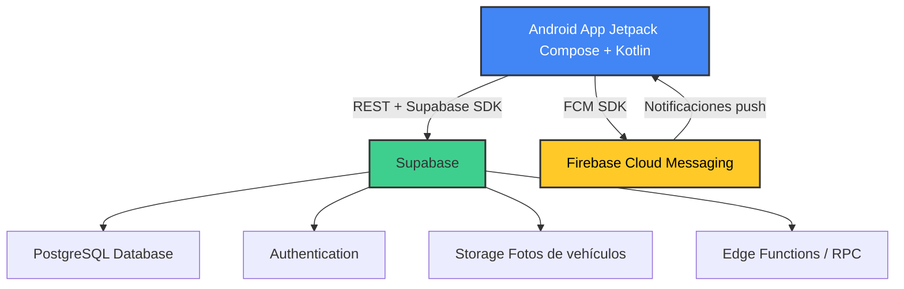

# 🚗 U-Park - Sistema Inteligente de Gestión de Parqueos

[](https://kotlinlang.org/)
[](https://developer.android.com/jetpack/compose)
[](https://supabase.com/)
[](https://firebase.google.com/)

**U-Park** es una aplicación móvil moderna para **Android** que digitaliza y automatiza la gestión de garajes y parqueos vehiculares, eliminando filas, errores humanos y pérdidas de tiempo.

Desarrollada 100% con **Kotlin + Jetpack Compose**, backend en **Supabase** y notificaciones en tiempo real con **Firebase Cloud Messaging**.

## 📱 ¿Qué es U-Park?

Una app que conecta a **administradores**, **empleados** y **clientes** en un sistema inteligente de parqueo donde puedes:

- Registrar vehículos fácilmente  
- Controlar entradas y salidas en tiempo real  
- Calcular pagos automáticamente  
- Recibir notificaciones push  
- Consultar disponibilidad de espacios  
- Generar comprobantes digitales  
- Guardar evidencia fotográfica  

¡Todo desde el celular!

## 🔐 Roles del sistema

| Rol            | Funciones principales                                                                 |
|----------------|---------------------------------------------------------------------------------------|
| **Administrador** | Configurar tarifas<br>Gestionar parqueos y espacios<br>Administrar empleados<br>Generar reportes y estadísticas |
| **Empleado**      | Registrar entradas y salidas<br>Tomar fotos de vehículos<br>Validar pagos y tickets   |
| **Cliente**       | Registrar vehículos propios<br>Consultar historial de parqueos<br>Recibir notificaciones push<br>Ver tickets y comprobantes |

## ⚙️ Funcionalidades principales

- 🚘 **Gestión de vehículos**  
  Registro completo (placa, marca, modelo, color, año)  
  Asociación automática a usuarios

- 🅿️ **Control de parqueo**  
  Registro de entrada y salida automática  
  Asignación inteligente de espacios disponibles  
  Cálculo en tiempo real del tiempo de permanencia

- 💵 **Tarifas y pagos**  
  Tarifas flexibles: por hora, por día o mensual  
  Cálculo automático del monto a pagar  
  Generación de tickets / comprobantes digitales

- 📲 **Notificaciones push** (Firebase Cloud Messaging)  
  - Confirmación inmediata de entrada  
  - Avisos por tiempo excedido o recordatorio de pago  
  - Confirmación de salida y monto final

- 📸 **Evidencia visual**  
  Captura automática de fotos del vehículo al ingresar  
  Almacenadas de forma segura en Supabase Storage

- 📊 **Historial completo**  
  Registro de todos los parqueos realizados  
  Consultable por clientes (sus propios vehículos) y administradores (global)

## 🗄️ Backend con Supabase

- 🔑 Autenticación segura  
  Soporte para email + contraseña, teléfono y OAuth (si se expande)

- 🗃️ Base de datos PostgreSQL  
  Tablas para usuarios, vehículos, parqueos, tarifas, historial y pagos

- 📷 Storage  
  Almacenamiento de fotos de vehículos (entrada/salida)

- ⚡ Funciones RPC (PostgreSQL Functions)  
  Lógica del negocio ejecutada directamente en el backend:  
  - `registrar_entrada()`  
  - `registrar_salida()`  
  - `calcular_salida_preview()`  
  - `asignar_espacio()`  
  - `generar_ticket()`
 
  ## 📦 Dependencias Principales

Este proyecto utiliza varias librerías y servicios para garantizar un desarrollo rápido, moderno y eficiente:

### AndroidX
```kotlin
implementation(libs.androidx.core.ktx)
implementation(libs.androidx.lifecycle.runtime.ktx)
implementation(libs.androidx.activity.compose)
```
### JetPack Compose
```kotlin
implementation(platform(libs.androidx.compose.bom))
implementation(libs.androidx.compose.ui)
implementation(libs.androidx.compose.ui.graphics)
implementation(libs.androidx.compose.ui.tooling.preview)
implementation(libs.androidx.compose.material3)
```
### 🔥 Firebase
```kotlin
implementation(platform("com.google.firebase:firebase-bom:33.4.0"))
implementation("com.google.firebase:firebase-messaging-ktx")
implementation("com.google.firebase:firebase-analytics-ktx")
```

### Supabase
```kotlin
implementation(platform("io.github.jan-tennert.supabase:bom:3.2.4"))
implementation("io.github.jan-tennert.supabase:postgrest-kt")
implementation("io.ktor:ktor-client-android:3.3.1")
implementation("io.github.jan-tennert.supabase:storage-kt")
implementation("io.github.jan-tennert.supabase:gotrue-kt:2.5.0")
```
### Coil & DataStore
```kotlin
implementation("io.coil-kt:coil-compose:2.7.0")
implementation("androidx.datastore:datastore-preferences:1.1.1")
```

### Ubicación
```kotlin
implementation("com.google.android.gms:play-services-location:21.3.0")
```

### 💻 Requisitos

- Android Studio Bumblebee o superior.

- Kotlin 1.9+.

- SDK mínimo: 24.

- Configuración de Firebase y Supabase para funcionalidades completas.

## 📦 Instalación y configuración

1. Clona el repositorio

   ```bash
   git clone https://github.com/NotGaabo/U-Park.git

2. Abre el proyecto en Android Studio

3. Configura las claves necesarias:
   
   ```bash
   # En \app\src\main\java\com\kotlin\u_park\data\remote\SupabaseClient
    SUPABASE_URL="https://tu-proyecto.supabase.co"
    SUPABASE_ANON_KEY="eyJhbGciOi..."

4. Sincroniza Gradle → Compila y ejecuta en emulador o dispositivo físico
5. 
# Archivo google-services.json (descárgalo desde Firebase Console)

## 🎯 Objetivo del proyecto

U-Park nace como solución técnica y profesional para resolver problemas reales en la gestión de parqueos:

- 🚫 **Eliminar filas y esperas innecesarias**  
- 🛑 **Reducir errores humanos** y pérdidas económicas por cobros incorrectos  
- 🔒 **Aumentar la seguridad** mediante registro fotográfico y trazabilidad digital  
- 😊 **Mejorar la experiencia del cliente** (todo desde el celular, sin papeleo ni complicaciones)  
- ⚡ **Facilitar y agilizar** el trabajo diario del personal administrativo y de vigilancia

## 👨‍💻 Desarrolladores

- **Yoensi Manuel Arias Ogando**  

**Estudiante de 6to F – Bachillerato Técnico Profesional**  
**Instituto Politécnico Parroquial Santa Ana**  
Santo Domingo, República Dominicana


## 🏗️ Arquitectura


---

¡Gracias por visitar U-Park! 🚀  
¿Ideas, sugerencias o quieres colaborar?  
Abre un **issue** o envía un **pull request** con gusto.
